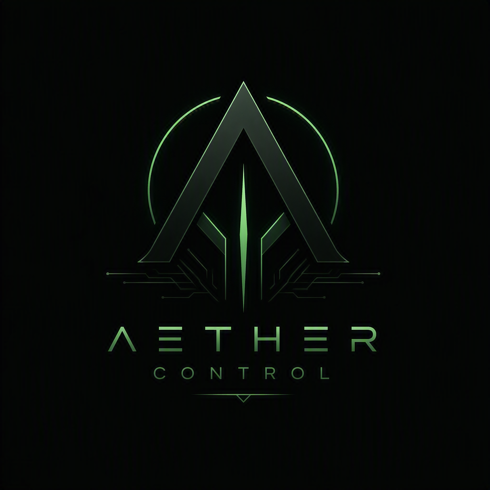

<p align="center">
  
</p>

<h1 align="center">Aether Control</h1>

<p align="center">
  An all-in-one control suite for custom gaming PCs — hardware monitoring,
  a real portrait-display mode, a Windows optimisation centre, RGB control
  without extra software, and per-game automation — in one clean, fast,
  unpackaged Windows app.
</p>

<p align="center">
  
  
  
  
</p>

---

## Why

Every existing option is either bloated and slow (HWiNFO's sheer density,
Armoury Crate's background services), locked to one vendor's ecosystem
(NZXT CAM, ASUS Aura), or asks you to install something else first (OpenRGB,
RTSS, iCUE) just to see your own hardware. Aether Control is built to be
**significantly cleaner, faster, and more focused** than any of them — real
sensor data, real RGB control, real Windows tuning, with as few extra moving
parts as the platform allows.

## Screenshots

<!--
  TODO: drop real screenshots into docs/screenshots/ and reference them here.
  Suggested set: Dashboard (wide), Optimisation Centre (Fan Control + Game
  Profiles), RGB Control (Detected Hardware), Portrait Mode. Crop out any
  personal data (e.g. the Network card's external IP) before committing.
-->

*Screenshots coming soon — see [docs/screenshots](docs/screenshots).*

## Features

### Dashboard
Live CPU / GPU / RAM / Storage / Motherboard / Network monitoring with
radial gauges, sparkline history, and tone-based severity colouring (a
metric doesn't just show a number — it tells you at a glance whether it's
fine, warm, or hot). A "Top Processes" panel answers "what's actually using
my CPU right now" without opening Task Manager.

### Portrait Mode
A dedicated layout for a second monitor rotated to portrait — CPU/GPU usage
rings with history sparklines, per-fan RPM with click-to-rename, RAM/drive
temp, live FPS (reads RTSS shared memory directly, no plugin needed), and a
top-processes panel. Drag it onto any monitor and one-click fill the screen
exactly; toggle again to restore.

### Windows Optimisation Centre
- **Memory optimisation** — trims working sets and purges the standby list,
  with a before/after/freed readout. Never terminates or interferes with any
  process.
- **Storage Cleaner** — scans real on-disk sizes per location before
  touching anything; you pick what to clear, not a blind "clean everything."
- **Startup Manager** — publisher, launch location, and impact per entry
  (not just a name and a toggle), with an at-a-glance high-impact count.
- **Fan Control** — reads *and writes* motherboard PWM fan headers directly
  via LibreHardwareMonitor, with a 20% safety floor and automatic revert to
  BIOS control on exit. Warns you if vendor fan software is fighting for the
  same ports instead of failing silently.
- **Gaming Profile** — Game Mode + High Performance power plan, fully
  reversible.
- **Game Profiles** — track a game's executable; Gaming Profile applies the
  moment it launches and reverts once every tracked game has closed.

### RGB Control
Corsair keyboards and mice are controlled **directly over USB** — no iCUE,
no OpenRGB, nothing to install. Everything else routes through OpenRGB's SDK
server if it's running. Peripheral *detection* (what's plugged in, by vendor)
works independently of control and needs zero vendor software either.

### Device Utilities & Firmware Centre
Detected peripherals by vendor (Corsair/Logitech/Razer/SteelSeries/ASUS/
Glorious/HyperX), quick links to each vendor's own configuration software,
and a current-version-only firmware/driver overview — Aether Control never
auto-installs updates, only tells you what you have and links you to check.

### Alerts & Tray
Windows toast notifications when CPU/GPU temperature crosses a threshold you
set, with hysteresis so it doesn't spam you sitting right at the line. The
tray icon's tooltip shows live metrics on hover — configurable in Settings.

### History
Daily/weekly/monthly rollups of every tracked metric, charted.

### Plugin framework
`IAetherPlugin` plus optional capability interfaces
(`IDashboardWidgetProvider`, `ITrayMetricProvider`, `IOptimisationTaskProvider`).
Each plugin loads into its own collectible `AssemblyLoadContext` — add or
remove one without restarting or touching the core app.

## What's here

| Project | TFM | Purpose |
|---|---|---|
| `AetherControl.Core` | net8.0 | Models, enums, service interfaces, events — no dependencies |
| `AetherControl.Plugins.Abstractions` | net8.0 | `IAetherPlugin` and capability interfaces third-party modules implement |
| `AetherControl.Data` | net8.0 | SQLite schema, migrations, repositories (settings, history, layouts) |
| `AetherControl.Services` | net8.0-windows | Hardware monitoring (LibreHardwareMonitor), optimisation, RGB (Corsair direct HID + OpenRGB), firmware/driver detection, plugin loading |
| `AetherControl.App` | net8.0-windows10.0.19041.0 | WinUI 3 shell — dashboard, portrait mode, tray, all feature pages |
| `AetherControl.Plugins.Sample` | net8.0 | Reference plugin (system uptime widget) |
| `tests/AetherControl.Tests` | net8.0-windows | xUnit tests against the Data/Services layer |

## Building

```bash
dotnet build src/AetherControl.Core
dotnet build src/AetherControl.Data
dotnet build src/AetherControl.Plugins.Abstractions
dotnet build src/AetherControl.Services
dotnet build src/AetherControl.Plugins.Sample
dotnet test  tests/AetherControl.Tests
```

The WinUI 3 head project needs **Visual Studio 2022** with the **Windows
application development** workload (for `Microsoft.Build.Packaging.Pri.Tasks.dll`,
used by resource indexing even in unpackaged builds):

```bash
msbuild src/AetherControl.App/AetherControl.App.csproj -p:Configuration=Debug -p:Platform=x64
```

Aether Control ships as its own standalone `.exe` — unpackaged, not MSIX.

## Architecture at a glance

- **MVVM** throughout the app layer — `CommunityToolkit.Mvvm` for
  `ObservableObject`/`[RelayCommand]`, plain constructor injection resolved
  from a `Microsoft.Extensions.Hosting` container (`App.Services`).
- **Modular by service interface** — every feature (hardware monitoring,
  optimisation, RGB, firmware, tray, alerts, game profiles) is an interface
  in `Core` with an implementation in `Services`, registered in
  `ServiceCollectionExtensions.AddAetherControlServices()`. Any one of them
  can be swapped or disabled without touching the others.
- **SQLite** (`Microsoft.Data.Sqlite`, WAL mode) for settings, tray
  preferences, portrait layouts, sensor history, RGB presets, startup
  overrides, and the optimisation run log — plus small standalone JSON
  stores (fan labels, alert thresholds, game profiles) for state that
  doesn't need a relational shape.
- **One safe hardware session, with self-healing reads.** LibreHardwareMonitor
  doesn't support multiple concurrent `Computer` instances safely, so exactly
  one service owns it — fan RPM is read from that same session, not a second
  process (see below for why an earlier out-of-process design was removed).
  Already-installed vendor software (Armoury Crate, iCUE) still polls the same
  motherboard chip on its own schedule regardless of anything Aether does, and
  a live capture confirmed a real board can return an impossible "poisoned"
  read (every voltage rail collapsed to one of two identical values) that
  never self-corrects on its own. `HardwareMonitorService` detects this,
  serves the last known-good reading instead of publishing garbage, and
  reopens the session (rate-limited) until a clean read returns — confirmed
  self-healing in under 2 seconds against a real ~11-second periodic
  collision on this machine.

## Design principles that shaped real decisions

- **No extra software required, wherever avoidable.** Corsair RGB is
  controlled directly over USB HID — the same wire-level access OpenRGB
  itself uses, just without needing OpenRGB installed. FPS reads RTSS's
  shared memory segment directly rather than requiring a plugin.
- **Confidently wrong is worse than honestly unavailable.** When a sensor
  doesn't exist for a given board/CPU (e.g. this AMD Ryzen 7 9800X3D exposes
  no real core-voltage sensor on the LibreHardwareMonitor version in use —
  only a VRM-requested VID, not a measurement), the UI hides that card
  rather than display a plausible-looking wrong number.
- **Trace real data before fixing.** More than one "obvious" sensor-mapping
  bug turned out to be a real hardware/OS behaviour (Windows core-parking
  rotating which CPU cores are active at idle looks identical to a flicker
  bug at a glance) — see [ROADMAP.md](ROADMAP.md) Phase 10 for the full story
  of chasing that down with a real diagnostic trace instead of a fourth guess.
- **A vendor library's own number isn't automatically the right one.** GPU%
  is read from the same Windows GPU-engine performance counter Task Manager
  itself uses rather than LibreHardwareMonitor's driver-level load sensor
  (confirmed, side by side, to measure something different); RAM usage is
  read via `GlobalMemoryStatusEx` directly after LibreHardwareMonitor's own
  Memory sensor was caught — via a live diagnostic — reporting physically
  impossible numbers on real hardware. When a metric can be sourced two
  ways, the one that matches what the OS itself reports wins.
- **Reversibility for anything touching live hardware state.** Fan control
  clamps away from 0% and always reverts to automatic/BIOS control on exit;
  memory optimisation never terminates a process; Storage Cleaner previews
  real sizes before deleting anything.

## Reused from Matt's existing projects

Rather than re-deriving hardware-sensor behaviour from scratch, the parts
that needed real-hardware validation were ported from proven, already-tested
code:

- **Portrait Stats** — CPU/GPU/RAM sensor name-matching (AMD `Tctl/Tdie`,
  `Core Max`, `Cores (Average)` fallbacks), best-GPU-by-VRAM selection for
  multi-GPU systems, `FanLabelStore` (user-assigned fan channel names),
  `ProcessRankerService` (CPU/GPU top-process ranking), `RtssFpsSource`
  (direct RTSS shared-memory FPS reads), and Portrait Mode's entire layout
  and control set (`RadialGauge`, `Sparkline`, `MetricTile`, `VendorBadge`)
  — ported rather than reinvented, at Matt's own request. Fan RPM used to be
  read by a separate short-lived process (`AetherControl.FanHelper.exe`),
  under the assumption that `AsusFanControlService` reclaiming the Super I/O
  ports caused RPM to stick at 0. A live A/B test disproved that specific
  claim — the real cause then was a LibreHardwareMonitorLib version gap — but
  a second process reading the same chip turned out to cause a *worse*,
  related problem: two concurrent readers can make both sides read back
  garbage persistently. `AetherControl.FanHelper.exe` was removed; fan RPM is
  now read from the single shared session, which self-heals from genuine
  external contention instead (see "One safe hardware session" above).
  Portrait Mode's colour palette was later unified with Aether Control's own
  single-accent theme instead of staying a separate port.
- **OmenCore** — `CorsairHidDirect` ported into `CorsairHidDirectService`:
  direct-HID Corsair keyboard/mouse RGB control (no iCUE, no OpenRGB),
  including the full known-product table and per-PID HID report layouts
  learned empirically in that project. Also the source of the honest "why
  not" answer on two other features considered and deliberately not ported —
  see [ROADMAP.md](ROADMAP.md) Phase 18/19 for why its BIOS-checker and
  undervolting code don't transfer safely to this project.
- **Radium PCs Companion** — visual reference for radial gauges, animated
  numbers, severity-based tone colouring, the RAM cleaner technique, and
  Startup Manager's actual layout (summary tiles, publisher + location +
  raw command per row, a coloured impact badge) — read from its real
  `StartupManagerPage.tsx` rather than guessed.

## Roadmap

Aether Control has been built in tracked phases — [ROADMAP.md](ROADMAP.md)
is the full, honest build log: what's done, what's deliberately deferred and
why, and bugs that were root-caused with real diagnostic traces rather than
guessed at. Highlights of where things stand:

**Shipped**
- Full hardware dashboard (CPU/GPU/RAM/Storage/Motherboard/Network) with a
  responsive two-column layout, radial gauges, sparkline history, and
  tone-based severity colouring
- Portrait Mode — a real, complete port of the reference app's layout, not a
  stub, with working drag-to-monitor and fill-to-screen
- Optimisation Centre: memory optimisation, Storage Cleaner, Startup
  Manager, Fan Control (read *and* write), Gaming Profile, Game Profiles
- RGB Control: direct-HID Corsair control (no extra software) + OpenRGB for
  everything else, merged behind one interface
- Peripheral detection by USB vendor ID, zero vendor software required
- Temperature alerts (Windows toast, configurable thresholds, hysteresis)
- Tray icon live metrics on hover
- Accent colour theming
- Plugin framework with a working sample plugin

**Deliberately not done (and why, not just "later")**
- Undervolting — the reference implementation needs a kernel-mode driver
  (a real "extra software requirement") and its exact register values were
  tuned for different silicon than what this project targets; flagged
  rather than shipped blind
- HP-style BIOS auto-checking — the reference implementation is HP-laptop
  specific and, by its own admission, mostly just links to a support page
  rather than doing a real version check
- Per-game RGB colour/lighting profiles — a real possibility now that
  direct RGB control exists, just not wired up yet

**In progress / next**
- Bundled OpenRGB management for non-Corsair RGB devices (removing the
  "start OpenRGB yourself" step entirely)
- Logitech/Razer direct control, same approach as Corsair
- Product-style imagery on device/drive cards
- NavigationView pane visual polish

## Known limitations

See the "Known limitations" notes throughout [ROADMAP.md](ROADMAP.md) —
notably that the OpenRGB mode-switching packet is structurally implemented
per the documented protocol but not yet verified against a live OpenRGB
server, and that Settings' accent-colour picker fully re-skins the app's own
custom controls live but stock WinUI controls (buttons, switches) need a
restart to pick up a new accent.

## License

All rights reserved. This is Matt's personal project, shared publicly for
visibility; no license is granted for reuse without permission.
